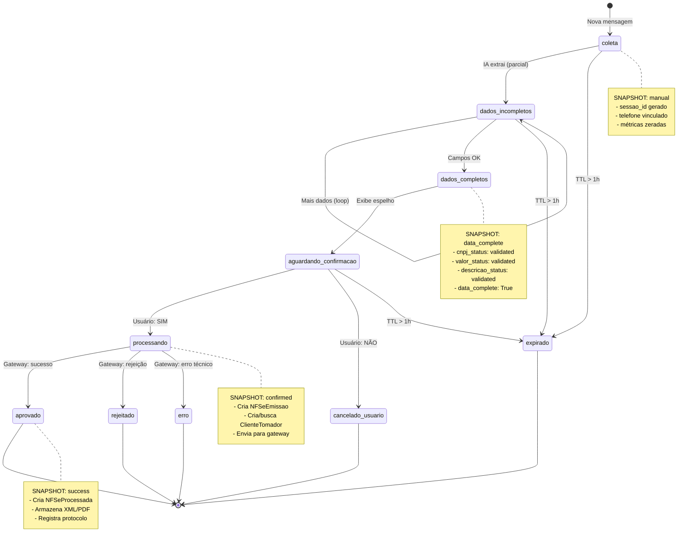
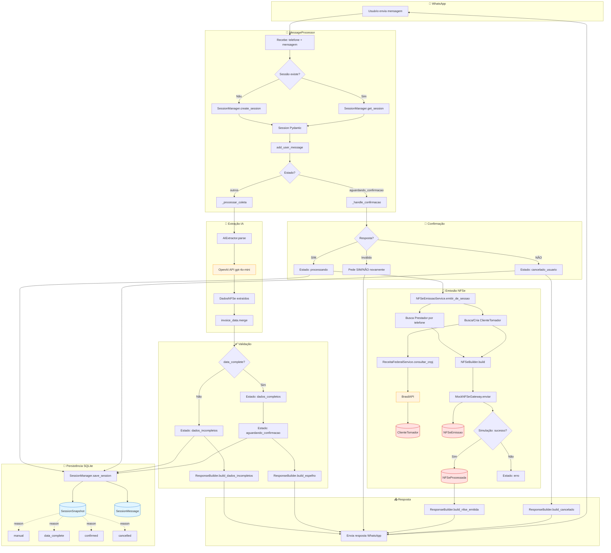
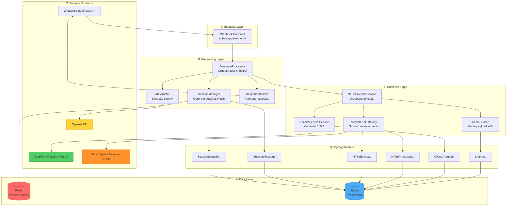
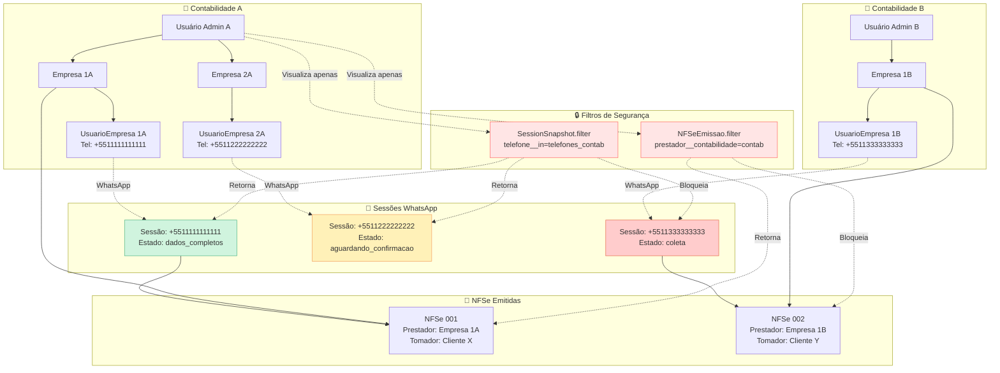
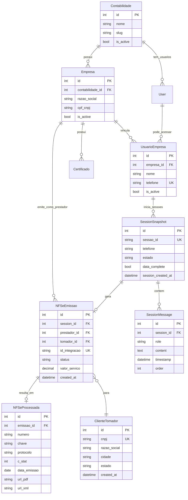

# Diagramas de Fluxo - AgentNFe

Este documento contém os diagramas Mermaid para visualização dos fluxos do sistema.

---

## 📊 Diagrama 1: Máquina de Estados

Visualização completa da máquina de estados e transições.

---

## 🔄 Diagrama 2: Fluxo Completo de Dados

Visualização end-to-end do processamento de mensagens.

---

## 🏗️ Diagrama 3: Arquitetura de Componentes

Visão das camadas e responsabilidades.

---

## 🔐 Diagrama 4: Segurança Multi-Tenant

Isolamento de dados por contabilidade.

---

## 📊 Diagrama 5: Modelo de Dados Simplificado

Relacionamentos entre entidades principais.

---

## 🎨 Legenda de Cores

### Nos Diagramas de Fluxo:
- 🔵 **Azul claro** (`#e1f5ff`): Persistência principal (SessionSnapshot, SessionMessage)
- 🔴 **Vermelho claro** (`#ffe1e1`): Dados NFSe (NFSeEmissao, NFSeProcessada, ClienteTomador)
- 🟡 **Amarelo claro** (`#fff4e1`): APIs externas (OpenAI, BrasilAPI)

### Nos Diagramas de Estados:
- 🟢 **Verde**: Estados de sucesso (aprovado, dados_completos)
- 🟡 **Amarelo**: Estados de espera (aguardando_confirmacao)
- 🔴 **Vermelho**: Estados de erro/cancelamento
- 🔵 **Azul**: Estados em processamento

---

## 📖 Como Usar Este Documento

1. **Para entender o fluxo geral**: Comece pelo **Diagrama 2** (Fluxo Completo)
2. **Para entender estados**: Veja **Diagrama 1** (Máquina de Estados)
3. **Para entender arquitetura**: Consulte **Diagrama 3** (Componentes)
4. **Para entender segurança**: Analise **Diagrama 4** (Multi-Tenant)
5. **Para entender dados**: Estude **Diagrama 5** (Modelo de Dados)

Combine com a leitura de [`ESTADOS_E_PERSISTENCIA.md`](ESTADOS_E_PERSISTENCIA.md) para detalhes completos.
