# Diagrama de Classes do Banco de Dados

## Visão Geral

Este documento apresenta a estrutura completa de classes (modelos Django) do sistema de emissão de NFSe, mostrando todas as entidades, seus atributos e relacionamentos.

---

## Diagrama de Classes Completo

```mermaid
classDiagram
    %% ==================== APP: ACCOUNT ====================
    class User {
        +int id
        +string email (unique)
        +string password
        +string first_name
        +string last_name
        +string role (admin/gerente/atendente)
        +string phone
        +bool is_staff
        +bool is_superuser
        +bool is_active
        +datetime date_joined
        +ForeignKey contabilidade
    }

    %% ==================== APP: CONTABILIDADE ====================
    class Contabilidade {
        +int id
        +string cnpj (unique, max=18)
        +string razao_social (max=200)
        +string nome_fantasia (max=200)
        +string email
        +string telefone_ddd (max=2)
        +string telefone_numero (max=15)
        +string cep (max=9)
        +string logradouro (max=200)
        +string numero (max=20)
        +string complemento (max=100)
        +string bairro (max=100)
        +string cidade (max=100)
        +string estado (max=2)
        +bool is_active
        +datetime created_at
        +datetime updated_at
    }

    class Empresa {
        +int id
        +ForeignKey contabilidade
        +string cpf_cnpj (max=18)
        +string razao_social (max=200)
        +string nome_fantasia (max=200)
        +string inscricao_municipal (max=20)
        +string inscricao_estadual (max=20)
        +bool simples_nacional
        +int regime_tributario (1-3)
        +bool incentivo_fiscal
        +bool incentivador_cultural
        +int regime_tributario_especial (0-6)
        +string cep (max=9)
        +string logradouro (max=200)
        +string numero (max=20)
        +string complemento (max=100)
        +string bairro (max=100)
        +string tipo_logradouro (max=50)
        +string tipo_bairro (max=50)
        +string codigo_cidade (max=7)
        +string descricao_cidade (max=100)
        +string estado (max=2)
        +string codigo_pais (max=4)
        +string descricao_pais (max=100)
        +string telefone_ddd (max=2)
        +string telefone_numero (max=15)
        +string email
        +bool nfse_ativo
        +bool nfse_producao
        +string tecnospeed_id (max=50)
        +bool is_active
        +datetime created_at
        +datetime updated_at
    }

    class UsuarioEmpresa {
        +int id
        +ForeignKey empresa
        +string nome (max=200)
        +string cpf (max=14)
        +string telefone (max=20)
        +string email
        +string cep (max=9)
        +string logradouro (max=200)
        +string numero (max=20)
        +string complemento (max=100)
        +string bairro (max=100)
        +string cidade (max=100)
        +string estado (max=2)
        +bool is_active
        +datetime created_at
        +datetime updated_at
    }

    class Certificado {
        +int id
        +ForeignKey empresa
        +FileField arquivo
        +string senha (max=100)
        +string nome_titular (max=200)
        +string cnpj_titular (max=18)
        +date validade
        +string tecnospeed_id (max=50)
        +bool enviado_tecnospeed
        +datetime data_envio_tecnospeed
        +bool is_active
        +datetime created_at
        +datetime updated_at
        +property is_valid
        +property days_to_expire
    }

    %% ==================== APP: CORE ====================
    class SessionSnapshot {
        +int id
        +string sessao_id (unique, max=20)
        +string telefone (max=20)
        +string usuario_nome (max=200)
        +string empresa_nome (max=200)
        +int empresa_id
        +string estado (max=25)
        +string cnpj_status (max=10)
        +string cnpj_extracted (max=30)
        +string cnpj (max=18)
        +string cnpj_razao_social (max=200)
        +text cnpj_issue
        +string cnpj_error_type (max=50)
        +string valor_status (max=10)
        +string valor_extracted (max=50)
        +decimal valor (12,2)
        +string valor_formatted (max=30)
        +text valor_issue
        +string valor_error_type (max=50)
        +string descricao_status (max=10)
        +text descricao_extracted
        +text descricao
        +text descricao_issue
        +string descricao_error_type (max=50)
        +bool data_complete
        +json missing_fields
        +json invalid_fields
        +text user_message
        +string id_integracao (max=50)
        +int interaction_count
        +int bot_message_count
        +int ai_calls_count
        +json context
        +datetime created_at
        +datetime updated_at
        +int ttl
        +datetime expired_at
        +string snapshot_reason (max=20)
    }

    %% ==================== APP: NFSE ====================
    class ClienteTomador {
        +int id
        +string cnpj (unique, max=14)
        +string razao_social (max=255)
        +string nome_fantasia (max=255)
        +string email
        +string telefone (max=20)
        +string inscricao_municipal (max=20)
        +string inscricao_estadual (max=20)
        +string cep (max=8)
        +string logradouro (max=255)
        +string numero (max=10)
        +string complemento (max=100)
        +string bairro (max=100)
        +string cidade (max=100)
        +string codigo_cidade (max=7)
        +string estado (max=2)
        +datetime created_at
        +datetime updated_at
        +json dados_receita_raw
    }

    class EmpresaClienteTomador {
        +int id
        +ForeignKey empresa
        +ForeignKey cliente_tomador
        +datetime primeira_nota_em
        +datetime ultima_nota_em
        +bool is_active
        +string apelido (max=100)
        +text observacoes
        +get_notas_emitidas()
        +property total_notas
        +property total_valor_emitido
        +property ultima_nota
        +notas_por_periodo()
        +notas_por_status()
        +estatisticas()
    }

    class NFSeEmissao {
        +int id
        +ForeignKey session
        +ForeignKey prestador
        +ForeignKey tomador
        +string id_integracao (unique, max=50)
        +string status (max=20)
        +string codigo_servico (max=10)
        +string codigo_tributacao (max=10)
        +text descricao_servico
        +string cnae (max=10)
        +decimal valor_servico (12,2)
        +decimal desconto_condicionado (12,2)
        +decimal desconto_incondicionado (12,2)
        +int tipo_tributacao
        +int exigibilidade
        +decimal aliquota (5,2)
        +json payload_enviado
        +json resposta_gateway
        +datetime created_at
        +datetime enviado_em
        +datetime processado_em
        +text erro_mensagem
    }

    class NFSeProcessada {
        +int id
        +OneToOneField emissao
        +string id_externo (unique, max=50)
        +string numero (max=20)
        +string serie (max=10)
        +string chave (unique, max=100)
        +string protocolo (max=50)
        +string status (max=50)
        +text mensagem
        +int c_stat
        +string emitente (max=14)
        +string destinatario (max=14)
        +decimal valor (12,2)
        +date data_emissao
        +date data_autorizacao
        +url url_xml (max=500)
        +url url_pdf (max=500)
        +bool destinada
        +string documento (max=20)
        +json webhook_payload
        +datetime created_at
        +datetime updated_at
    }

    %% ==================== RELACIONAMENTOS ====================
    
    %% Account ↔ Contabilidade
    User "N" --> "1" Contabilidade : contabilidade
    Contabilidade "1" --> "N" User : usuarios
    
    %% Contabilidade ↔ Empresa
    Contabilidade "1" --> "N" Empresa : empresas
    Empresa "N" --> "1" Contabilidade : contabilidade
    
    %% Empresa ↔ UsuarioEmpresa
    Empresa "1" --> "N" UsuarioEmpresa : usuarios_autorizados
    UsuarioEmpresa "N" --> "1" Empresa : empresa
    
    %% Empresa ↔ Certificado
    Empresa "1" --> "N" Certificado : certificados
    Certificado "N" --> "1" Empresa : empresa
    
    %% Empresa ↔ ClienteTomador (via EmpresaClienteTomador)
    Empresa "1" --> "N" EmpresaClienteTomador : clientes_tomadores_vinculados
    EmpresaClienteTomador "N" --> "1" Empresa : empresa
    
    ClienteTomador "1" --> "N" EmpresaClienteTomador : empresas_vinculadas
    EmpresaClienteTomador "N" --> "1" ClienteTomador : cliente_tomador
    
    %% Empresa ↔ NFSeEmissao
    Empresa "1" --> "N" NFSeEmissao : nfse_emitidas
    NFSeEmissao "N" --> "1" Empresa : prestador
    
    %% SessionSnapshot ↔ NFSeEmissao
    SessionSnapshot "1" --> "N" NFSeEmissao : nfse_emissoes
    NFSeEmissao "N" --> "1" SessionSnapshot : session
    
    %% ClienteTomador ↔ NFSeEmissao
    ClienteTomador "1" --> "N" NFSeEmissao : nfse_recebidas
    NFSeEmissao "N" --> "1" ClienteTomador : tomador
    
    %% NFSeEmissao ↔ NFSeProcessada
    NFSeEmissao "1" --> "0..1" NFSeProcessada : nota_processada
    NFSeProcessada "1" --> "1" NFSeEmissao : emissao
```



---

## Descrição das Entidades

### App: Account

#### User
Usuário do sistema (administradores, gerentes, atendentes) que pertence a uma contabilidade específica. Usa email como identificador único.

---

### App: Contabilidade

#### Contabilidade
Empresa de contabilidade (tenant/multi-tenancy). Cada contabilidade é isolada e possui seus próprios usuários e empresas cliente.

#### Empresa
Empresa cliente da contabilidade que emite NFSe. Contém dados compatíveis com a API Tecnospeed para emissão de notas.

#### UsuarioEmpresa
Pessoa física autorizada a solicitar emissão de notas para uma empresa específica. São os usuários que interagem via WhatsApp.

#### Certificado
Certificado digital (.pfx) utilizado para assinar NFSe. Pertence a uma empresa e pode ser enviado para Tecnospeed.

---

### App: Core

#### SessionSnapshot
Snapshot persistente de uma sessão de conversa WhatsApp para emissão de NFSe. Armazena estado completo da máquina de estados, dados extraídos (CNPJ, Valor, Descrição) e métricas de interação.

---

### App: NFSe

#### ClienteTomador
Dados do tomador de serviços (cliente) obtidos da Receita Federal. Armazenado após validação do CNPJ para reutilização em futuras emissões. Um único ClienteTomador pode estar vinculado a múltiplas empresas prestadoras.

#### EmpresaClienteTomador
Tabela associativa que registra o relacionamento entre Empresa (prestadora) e ClienteTomador. Evita duplicação de dados do cliente e permite rastreamento de quando uma empresa trabalha com um cliente específico. Inclui métodos de auditoria para consultar histórico de notas emitidas.

#### NFSeEmissao
Registro de emissão de NFSe antes e durante o processamento. Vincula sessão, prestador (Empresa) e tomador (ClienteTomador).

#### NFSeProcessada
NFSe autorizada e processada. Dados recebidos via webhook da Tecnospeed após emissão bem-sucedida.

---

## Índices e Constraints

### Unique Constraints
- `User.email`
- `Contabilidade.cnpj`
- `Empresa.contabilidade + cpf_cnpj` (unique_together)
- `UsuarioEmpresa.empresa + telefone` (unique_together)
- `SessionSnapshot.sessao_id`
- `ClienteTomador.cnpj`
- `EmpresaClienteTomador.empresa + cliente_tomador` (unique_together)
- `NFSeEmissao.id_integracao`
- `NFSeProcessada.id_externo`
- `NFSeProcessada.chave`

### Índices de Banco de Dados
- `User.contabilidade_id`
- `Empresa.contabilidade_id + cpf_cnpj`
- `Empresa.contabilidade_id + is_active`
- `UsuarioEmpresa.empresa_id + telefone`
- `SessionSnapshot.sessao_id`
- `SessionSnapshot.telefone`
- `SessionSnapshot.empresa_id`
- `SessionSnapshot.estado`
- `ClienteTomador.cnpj`
- `EmpresaClienteTomador.empresa + cliente_tomador`
- `EmpresaClienteTomador.empresa + is_active`
- `EmpresaClienteTomador.-ultima_nota_em`
- `NFSeEmissao.id_integracao`
- `NFSeProcessada.id_externo`

---

## Relacionamentos Principais

### Multi-tenancy (Contabilidade)
```
Contabilidade (1) ←→ (N) Empresa
Contabilidade (1) ←→ (N) User
```

### Relacionamento Empresa-Cliente
```
Empresa (1) ←→ (N) EmpresaClienteTomador ←→ (N) ClienteTomador
```
Um ClienteTomador pode estar vinculado a múltiplas Empresas, e cada Empresa pode ter múltiplos ClientesTomadores. O vínculo registra quando uma empresa trabalha com um cliente.

### Emissão de NFSe
```
SessionSnapshot (1) ←→ (N) NFSeEmissao
Empresa (prestador) (1) ←→ (N) NFSeEmissao
ClienteTomador (tomador) (1) ←→ (N) NFSeEmissao
NFSeEmissao (1) ←→ (0..1) NFSeProcessada
```
Nota: NFSeEmissao mantém FK direto para ClienteTomador para integridade dos dados fiscais.

### Autorização WhatsApp
```
Empresa (1) ←→ (N) UsuarioEmpresa
```

### Certificado Digital
```
Empresa (1) ←→ (N) Certificado
```

---

## Observações Importantes

1. **Multi-tenancy**: Todo o sistema é isolado por `Contabilidade`. Usuários e empresas nunca cruzam fronteiras entre contabilidades.

2. **Sessões Temporárias**: `SessionSnapshot` armazena snapshots críticos. Sessões ativas ficam no Redis e são persistidas apenas em momentos-chave.

3. **Relacionamento Empresa-Cliente**: `EmpresaClienteTomador` é a tabela associativa M2M que evita duplicação de dados. Um `ClienteTomador` pode estar vinculado a múltiplas `Empresas`, permitindo compartilhamento de dados da Receita Federal sem redundância.

4. **Dados Fiscais**: `NFSeEmissao` armazena dados **antes/durante** processamento. `NFSeProcessada` armazena dados **após** autorização. O FK direto de `NFSeEmissao` para `ClienteTomador` garante integridade fiscal.

5. **Auditoria de Notas**: `EmpresaClienteTomador` possui métodos para consultar histórico completo de notas entre empresa e cliente, sem necessidade de campos adicionais (usa query reversa via FKs existentes).

6. **Cache de Tomadores**: `ClienteTomador` evita consultas repetidas à Receita Federal para CNPJs já validados.

5. **Auditoria**: Todos os modelos principais possuem `created_at` e `updated_at` para rastreabilidade.
