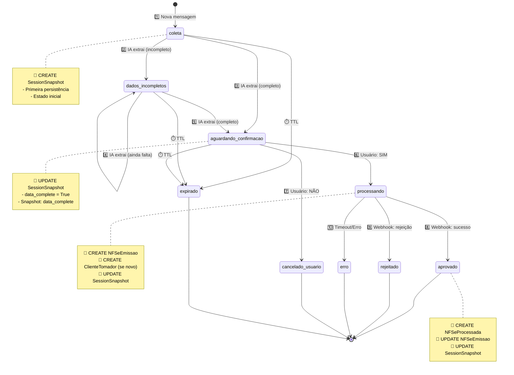
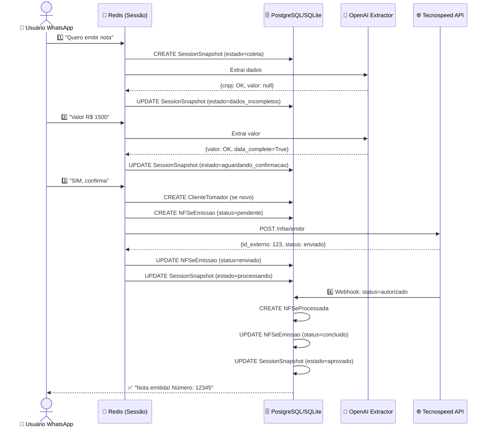

# Diagrama de Fluxo e Persistência de Dados

## Visão Geral

Este documento detalha **quando e como** os dados são salvos no banco de dados durante o fluxo de emissão de NFSe, mapeando cada estado da máquina de estados com as operações de persistência.

---

## Máquina de Estados e Persistência

### Estados da Sessão



---

## Fluxo Completo de Persistência

### 1️⃣ Estado: COLETA (Primeira Mensagem)

**Trigger**: Usuário envia primeira mensagem

**Operação**: `CREATE SessionSnapshot`

```python
# apps/core/session_manager.py
def get_or_create_session(telefone: str) -> Session:
    # Cria nova sessão em memória (Redis)
    session = Session(
        telefone=telefone,
        estado='coleta',
        sessao_id=gerar_id(),  # Ex: "270126-a3f1"
    )
    
    # 💾 PERSISTE snapshot inicial
    SessionSnapshot.objects.create(
        sessao_id=session.sessao_id,
        telefone=telefone,
        estado='coleta',
        snapshot_reason='manual',  # Primeira criação
        # Todos os campos _status = 'null'
        cnpj_status='null',
        valor_status='null',
        descricao_status='null',
        data_complete=False,
    )
    
    return session
```

**Dados Salvos**:
| Campo | Valor |
|-------|-------|
| `sessao_id` | "270126-a3f1" |
| `telefone` | "+5511999999999" |
| `estado` | "coleta" |
| `cnpj_status` | "null" |
| `valor_status` | "null" |
| `descricao_status` | "null" |
| `data_complete` | `False` |
| `snapshot_reason` | "manual" |

---

### 2️⃣ Estado: DADOS_INCOMPLETOS (Extração Parcial)

**Trigger**: IA extrai alguns dados, mas faltam campos

**Operação**: `UPDATE SessionSnapshot`

```python
# apps/core/message_processor.py
def process_message(session: Session, message: str):
    # IA extrai dados
    dados = agent_extractor.extract(message, session.invoice_data)
    
    # Merge com dados anteriores
    session.invoice_data = session.invoice_data.merge(dados)
    
    if not session.invoice_data.data_complete:
        # Transição: coleta → dados_incompletos
        session.update_estado('dados_incompletos')
        
        # 💾 ATUALIZA snapshot (não cria novo)
        SessionSnapshot.objects.filter(
            sessao_id=session.sessao_id
        ).update(
            estado='dados_incompletos',
            # Campos extraídos até agora
            cnpj_status=dados.cnpj.status,
            cnpj_extracted=dados.cnpj.cnpj_extracted,
            cnpj=dados.cnpj.cnpj,
            valor_status=dados.valor.status,
            valor=dados.valor.valor,
            # ...
            updated_at=timezone.now()
        )
```

**Dados Salvos** (exemplo):
| Campo | Valor |
|-------|-------|
| `estado` | "dados_incompletos" |
| `cnpj_status` | "validated" ✅ |
| `cnpj` | "12345678000190" |
| `cnpj_razao_social` | "EMPRESA TESTE LTDA" |
| `valor_status` | "null" ❌ |
| `descricao_status` | "null" ❌ |
| `data_complete` | `False` |
| `missing_fields` | `["valor", "descricao"]` |

---

### 3️⃣ Estado: AGUARDANDO_CONFIRMACAO (Dados Completos)

**Trigger**: IA extrai todos os campos obrigatórios

**Operação**: `UPDATE SessionSnapshot` + **Snapshot `data_complete`**

```python
def process_message(session: Session, message: str):
    dados = agent_extractor.extract(message, session.invoice_data)
    session.invoice_data = session.invoice_data.merge(dados)
    
    if session.invoice_data.data_complete:
        # Transição: dados_incompletos → aguardando_confirmacao
        session.update_estado('aguardando_confirmacao')
        
        # 💾 ATUALIZA snapshot
        snapshot = SessionSnapshot.objects.get(sessao_id=session.sessao_id)
        snapshot.estado = 'aguardando_confirmacao'
        snapshot.data_complete = True
        snapshot.cnpj_status = 'validated'
        snapshot.cnpj = dados.cnpj.cnpj
        snapshot.valor_status = 'validated'
        snapshot.valor = dados.valor.valor
        snapshot.descricao_status = 'validated'
        snapshot.descricao = dados.descricao.descricao
        snapshot.snapshot_reason = 'data_complete'  # 🎯 Marcador importante
        snapshot.save()
```

**Dados Salvos**:
| Campo | Valor |
|-------|-------|
| `estado` | "aguardando_confirmacao" |
| `cnpj_status` | "validated" ✅ |
| `cnpj` | "12345678000190" |
| `valor_status` | "validated" ✅ |
| `valor` | `1500.00` |
| `descricao_status` | "validated" ✅ |
| `descricao` | "Serviços de consultoria..." |
| `data_complete` | `True` ✅ |
| `missing_fields` | `[]` |
| `snapshot_reason` | "data_complete" 🎯 |

---

### 4️⃣ Estado: PROCESSANDO (Envio para Tecnospeed)

**Trigger**: Usuário responde "SIM" ou "confirma"

**Operações**:
1. `CREATE ClienteTomador` (se CNPJ não existe)
2. `CREATE NFSeEmissao`
3. `UPDATE SessionSnapshot`

```python
# apps/core/message_processor.py
def confirmar_emissao(session: Session):
    # 1. 💾 Busca ou cria tomador
    tomador, created = ClienteTomador.objects.get_or_create(
        cnpj=session.invoice_data.cnpj.cnpj,
        defaults={
            'razao_social': session.invoice_data.cnpj.razao_social,
            'cep': dados_receita['cep'],
            'logradouro': dados_receita['logradouro'],
            # ... outros campos da Receita
        }
    )
    
    # 2. 💾 Cria registro de emissão
    emissao = NFSeEmissao.objects.create(
        session=SessionSnapshot.objects.get(sessao_id=session.sessao_id),
        prestador=empresa,  # Empresa autenticada
        tomador=tomador,
        id_integracao=session.id_integracao,  # UUID
        status='pendente',
        valor_servico=session.invoice_data.valor.valor,
        descricao_servico=session.invoice_data.descricao.descricao,
        codigo_servico='14.10',
        # ... outros campos
    )
    
    # 3. Envia para Tecnospeed (externo)
    resposta = api_tecnospeed.enviar_nfse(emissao)
    
    # 4. 💾 Atualiza emissão com resposta
    emissao.status = 'enviado'
    emissao.payload_enviado = payload_json
    emissao.resposta_gateway = resposta
    emissao.enviado_em = timezone.now()
    emissao.save()
    
    # 5. 💾 Atualiza snapshot
    session.update_estado('processando')
    SessionSnapshot.objects.filter(sessao_id=session.sessao_id).update(
        estado='processando',
        id_integracao=session.id_integracao,
        snapshot_reason='confirmed'
    )
```

**Dados Salvos em `ClienteTomador`** (se novo):
| Campo | Valor |
|-------|-------|
| `cnpj` | "12345678000190" |
| `razao_social` | "EMPRESA TESTE LTDA" |
| `cep` | "01310100" |
| `logradouro` | "Avenida Paulista" |
| `cidade` | "São Paulo" |
| `dados_receita_raw` | `{...JSON completo...}` |

**Dados Salvos em `NFSeEmissao`**:
| Campo | Valor |
|-------|-------|
| `session_id` | `123` (FK → SessionSnapshot) |
| `prestador_id` | `45` (FK → Empresa) |
| `tomador_id` | `67` (FK → ClienteTomador) |
| `id_integracao` | "uuid-1234-5678" |
| `status` | "enviado" |
| `valor_servico` | `1500.00` |
| `descricao_servico` | "Serviços de consultoria..." |
| `payload_enviado` | `{...JSON...}` |
| `resposta_gateway` | `{...JSON...}` |

---

### 5️⃣ Estado: APROVADO (Webhook Sucesso)

**Trigger**: Webhook Tecnospeed retorna `status=autorizado`

**Operações**:
1. `CREATE NFSeProcessada`
2. `UPDATE NFSeEmissao`
3. `UPDATE SessionSnapshot`

```python
# apps/nfse/views.py (webhook endpoint)
def webhook_tecnospeed(request):
    payload = request.json()
    
    # Busca emissão
    emissao = NFSeEmissao.objects.get(id_integracao=payload['id_integracao'])
    
    # 1. 💾 Cria nota processada
    nota = NFSeProcessada.objects.create(
        emissao=emissao,
        id_externo=payload['id_externo'],
        numero=payload['numero'],
        chave=payload['chave_acesso'],
        protocolo=payload['protocolo'],
        status='autorizado',
        c_stat=payload['c_stat'],
        url_xml=payload['xml_url'],
        url_pdf=payload['pdf_url'],
        data_emissao=payload['data_emissao'],
        webhook_payload=payload,
    )
    
    # 2. 💾 Atualiza emissão
    emissao.status = 'concluido'
    emissao.processado_em = timezone.now()
    emissao.save()
    
    # 3. 💾 Atualiza snapshot
    SessionSnapshot.objects.filter(id_integracao=emissao.id_integracao).update(
        estado='aprovado',
        snapshot_reason='webhook_success'
    )
```

**Dados Salvos em `NFSeProcessada`**:
| Campo | Valor |
|-------|-------|
| `emissao_id` | `789` (FK → NFSeEmissao) |
| `numero` | "12345" |
| `chave` | "abc123xyz..." |
| `protocolo` | "prot-2024..." |
| `status` | "autorizado" |
| `c_stat` | `100` |
| `url_xml` | "https://tecnospeed.com/..." |
| `url_pdf` | "https://tecnospeed.com/..." |

---

### 6️⃣ Estados Terminais (Cancelamento/Erro)

#### CANCELADO_USUARIO
```python
# Usuário responde "NÃO" ou "cancelar"
session.update_estado('cancelado_usuario')

# 💾 ATUALIZA snapshot
SessionSnapshot.objects.filter(sessao_id=session.sessao_id).update(
    estado='cancelado_usuario',
    snapshot_reason='cancelled'
)
```

#### ERRO
```python
# Erro ao enviar para Tecnospeed
emissao.status = 'erro'
emissao.erro_mensagem = str(exception)
emissao.save()

session.update_estado('erro')

# 💾 ATUALIZA snapshot
SessionSnapshot.objects.filter(sessao_id=session.sessao_id).update(
    estado='erro',
    snapshot_reason='error'
)
```

#### EXPIRADO
```python
# TTL expira (job agendado)
session.update_estado('expirado')

# 💾 ATUALIZA snapshot
SessionSnapshot.objects.filter(sessao_id=session.sessao_id).update(
    estado='expirado',
    expired_at=timezone.now(),
    snapshot_reason='expired'
)
```

---

## Diagrama de Persistência por Estado



---

## Tabela Resumo: Estados × Persistência

| Estado | Operações BD | Tabelas Afetadas | Snapshot Reason |
|--------|-------------|------------------|-----------------|
| **coleta** | `CREATE` | SessionSnapshot | `manual` |
| **dados_incompletos** | `UPDATE` | SessionSnapshot | - |
| **aguardando_confirmacao** | `UPDATE` | SessionSnapshot | `data_complete` |
| **processando** | `CREATE` + `UPDATE` | ClienteTomador, NFSeEmissao, SessionSnapshot | `confirmed` |
| **aprovado** | `CREATE` + `UPDATE` | NFSeProcessada, NFSeEmissao, SessionSnapshot | `webhook_success` |
| **rejeitado** | `UPDATE` | NFSeEmissao, SessionSnapshot | `webhook_rejected` |
| **erro** | `UPDATE` | NFSeEmissao, SessionSnapshot | `error` |
| **cancelado_usuario** | `UPDATE` | SessionSnapshot | `cancelled` |
| **expirado** | `UPDATE` | SessionSnapshot | `expired` |

---

## Campos Importantes para Auditoria

### SessionSnapshot
- **`snapshot_reason`**: Indica motivo da persistência
  - `manual`: Criação inicial
  - `data_complete`: Dados completos validados
  - `confirmed`: Usuário confirmou emissão
  - `cancelled`: Usuário cancelou
  - `expired`: Sessão expirou
  - `error`: Erro técnico
  - `webhook_success`: NFSe autorizada
  - `webhook_rejected`: NFSe rejeitada

### NFSeEmissao
- **`payload_enviado`**: JSON enviado para Tecnospeed
- **`resposta_gateway`**: JSON recebido de Tecnospeed

### NFSeProcessada
- **`webhook_payload`**: JSON completo do webhook

### ClienteTomador
- **`dados_receita_raw`**: JSON da API Brasil API (Receita Federal)

---

## Observações Críticas

1. **Redis é Volátil**: Sessões ativas vivem apenas em Redis. Snapshots no BD são para auditoria e continuidade.

2. **Snapshot Reason**: Sempre preencher para rastreabilidade de quando/por que foi salvo.

3. **JSON Fields**: Sempre salvar payloads completos para debug e auditoria fiscal.

4. **Estados Terminais**: Nunca deletar registros de estados terminais (requerido por auditoria fiscal).

5. **TTL**: Sessões expiram em 1 hora. Job agendado persiste snapshot antes de limpar Redis.
