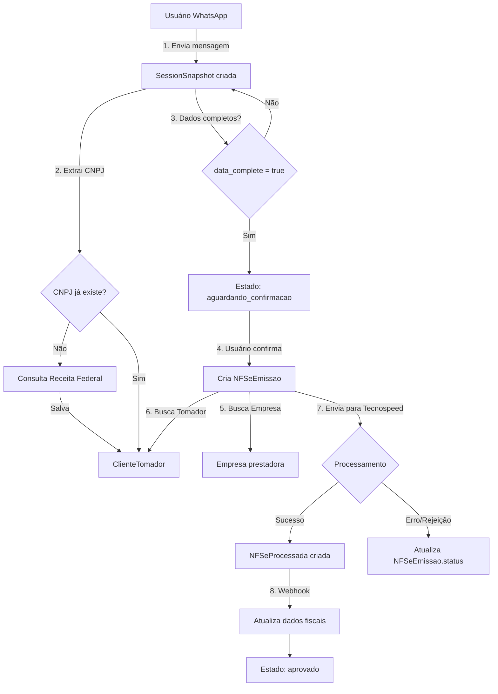

# Diagrama de Relacionamentos do Banco de Dados

## Visão Geral

Este documento apresenta o diagrama de relacionamentos (Entity Relationship Diagram - ERD) do sistema de emissão de NFSe, mostrando como as entidades se conectam e interagem.

---

## Diagrama ER Completo

```mermaid
erDiagram
    %% ==================== ENTIDADES PRINCIPAIS ====================
    
    CONTABILIDADE ||--o{ USER : "possui usuarios"
    CONTABILIDADE ||--o{ EMPRESA : "gerencia empresas"
    
    EMPRESA ||--o{ USUARIO_EMPRESA : "autoriza usuarios"
    EMPRESA ||--o{ CERTIFICADO : "possui certificados"
    EMPRESA ||--o{ NFSE_EMISSAO : "emite notas (prestador)"
    
    SESSION_SNAPSHOT ||--o{ NFSE_EMISSAO : "gera emissoes"
    
    CLIENTE_TOMADOR ||--o{ NFSE_EMISSAO : "recebe servicos (tomador)"
    
    NFSE_EMISSAO ||--o| NFSE_PROCESSADA : "resulta em nota"
    
    %% ==================== CONTABILIDADE ====================
    
    CONTABILIDADE {
        int id PK
        string cnpj UK "UNIQUE"
        string razao_social
        string nome_fantasia
        string email
        string telefone_ddd
        string telefone_numero
        string cep
        string logradouro
        string numero
        string complemento
        string bairro
        string cidade
        string estado
        bool is_active
        datetime created_at
        datetime updated_at
    }
    
    %% ==================== USER ====================
    
    USER {
        int id PK
        string email UK "UNIQUE"
        string password
        string first_name
        string last_name
        int contabilidade_id FK "→ CONTABILIDADE"
        string role "admin/gerente/atendente"
        string phone
        bool is_staff
        bool is_superuser
        bool is_active
        datetime date_joined
    }
    
    %% ==================== EMPRESA ====================
    
    EMPRESA {
        int id PK
        int contabilidade_id FK "→ CONTABILIDADE"
        string cpf_cnpj "UNIQUE com contabilidade_id"
        string razao_social
        string nome_fantasia
        string inscricao_municipal
        string inscricao_estadual
        bool simples_nacional
        int regime_tributario "1=SN, 2=SN-Excesso, 3=Normal"
        bool incentivo_fiscal
        bool incentivador_cultural
        int regime_tributario_especial "0-6"
        string cep
        string logradouro
        string numero
        string complemento
        string bairro
        string tipo_logradouro
        string tipo_bairro
        string codigo_cidade "IBGE"
        string descricao_cidade
        string estado
        string codigo_pais
        string descricao_pais
        string telefone_ddd
        string telefone_numero
        string email
        bool nfse_ativo
        bool nfse_producao
        string tecnospeed_id "ID API Tecnospeed"
        bool is_active
        datetime created_at
        datetime updated_at
    }
    
    %% ==================== USUARIO_EMPRESA ====================
    
    USUARIO_EMPRESA {
        int id PK
        int empresa_id FK "→ EMPRESA"
        string nome
        string cpf
        string telefone "UNIQUE com empresa_id"
        string email
        string cep
        string logradouro
        string numero
        string complemento
        string bairro
        string cidade
        string estado
        bool is_active
        datetime created_at
        datetime updated_at
    }
    
    %% ==================== CERTIFICADO ====================
    
    CERTIFICADO {
        int id PK
        int empresa_id FK "→ EMPRESA"
        file arquivo ".pfx"
        string senha
        string nome_titular
        string cnpj_titular
        date validade
        string tecnospeed_id
        bool enviado_tecnospeed
        datetime data_envio_tecnospeed
        bool is_active
        datetime created_at
        datetime updated_at
    }
    
    %% ==================== SESSION_SNAPSHOT ====================
    
    SESSION_SNAPSHOT {
        int id PK
        string sessao_id UK "UNIQUE ddmmyy-hex4"
        string telefone
        string usuario_nome
        string empresa_nome
        int empresa_id "Link soft (sem FK)"
        string estado "coleta/dados_incompletos/etc"
        string cnpj_status "validated/null/error/warning"
        string cnpj_extracted
        string cnpj
        string cnpj_razao_social
        text cnpj_issue
        string cnpj_error_type
        string valor_status
        string valor_extracted
        decimal valor
        string valor_formatted
        text valor_issue
        string valor_error_type
        string descricao_status
        text descricao_extracted
        text descricao
        text descricao_issue
        string descricao_error_type
        bool data_complete
        json missing_fields
        json invalid_fields
        text user_message
        string id_integracao "UUID para NFSe"
        int interaction_count
        int bot_message_count
        int ai_calls_count
        json context "Histórico mensagens"
        datetime created_at
        datetime updated_at
        int ttl
        datetime expired_at
        string snapshot_reason "manual/data_complete/etc"
    }
    
    %% ==================== CLIENTE_TOMADOR ====================
    
    CLIENTE_TOMADOR {
        int id PK
        string cnpj UK "UNIQUE"
        string razao_social
        string nome_fantasia
        string email
        string telefone
        string inscricao_municipal
        string inscricao_estadual
        string cep
        string logradouro
        string numero
        string complemento
        string bairro
        string cidade
        string codigo_cidade "IBGE"
        string estado
        datetime created_at
        datetime updated_at
        json dados_receita_raw "Auditoria API Receita"
    }
    
    %% ==================== NFSE_EMISSAO ====================
    
    NFSE_EMISSAO {
        int id PK
        int session_id FK "→ SESSION_SNAPSHOT"
        int prestador_id FK "→ EMPRESA"
        int tomador_id FK "→ CLIENTE_TOMADOR"
        string id_integracao UK "UNIQUE UUID"
        string status "pendente/enviado/processando/concluido/erro/cancelado"
        string codigo_servico
        string codigo_tributacao
        text descricao_servico
        string cnae
        decimal valor_servico
        decimal desconto_condicionado
        decimal desconto_incondicionado
        int tipo_tributacao
        int exigibilidade
        decimal aliquota "ISS %"
        json payload_enviado "JSON → Tecnospeed"
        json resposta_gateway "JSON ← Tecnospeed"
        datetime created_at
        datetime enviado_em
        datetime processado_em
        text erro_mensagem
    }
    
    %% ==================== NFSE_PROCESSADA ====================
    
    NFSE_PROCESSADA {
        int id PK
        int emissao_id FK "→ NFSE_EMISSAO (OneToOne)"
        string id_externo UK "UNIQUE"
        string numero
        string serie
        string chave UK "UNIQUE"
        string protocolo
        string status
        text mensagem
        int c_stat "Código fiscal"
        string emitente "CNPJ"
        string destinatario "CNPJ/CPF"
        decimal valor
        date data_emissao
        date data_autorizacao
        url url_xml
        url url_pdf
        bool destinada
        string documento "nfse"
        json webhook_payload "Webhook Tecnospeed"
        datetime created_at
        datetime updated_at
    }
```



---

## Descrição dos Relacionamentos

### 1. Contabilidade ↔ User
- **Tipo**: One-to-Many (1:N)
- **Descrição**: Uma contabilidade possui múltiplos usuários (administradores, gerentes, atendentes)
- **Constraint**: `User.contabilidade_id` → `Contabilidade.id` (nullable, CASCADE)

### 2. Contabilidade ↔ Empresa
- **Tipo**: One-to-Many (1:N)
- **Descrição**: Uma contabilidade gerencia múltiplas empresas cliente
- **Constraint**: `Empresa.contabilidade_id` → `Contabilidade.id` (CASCADE)
- **Unique Together**: `(contabilidade_id, cpf_cnpj)` - CNPJ único por contabilidade

### 3. Empresa ↔ UsuarioEmpresa
- **Tipo**: One-to-Many (1:N)
- **Descrição**: Uma empresa autoriza múltiplos usuários WhatsApp para solicitar emissões
- **Constraint**: `UsuarioEmpresa.empresa_id` → `Empresa.id` (CASCADE)
- **Unique Together**: `(empresa_id, telefone)` - Telefone único por empresa

### 4. Empresa ↔ Certificado
- **Tipo**: One-to-Many (1:N)
- **Descrição**: Uma empresa possui múltiplos certificados digitais (atual e expirados)
- **Constraint**: `Certificado.empresa_id` → `Empresa.id` (CASCADE)

### 5. Empresa ↔ NFSeEmissao (como Prestador)
- **Tipo**: One-to-Many (1:N)
- **Descrição**: Uma empresa (prestador) emite múltiplas NFSe
- **Constraint**: `NFSeEmissao.prestador_id` → `Empresa.id` (PROTECT)

### 6. SessionSnapshot ↔ NFSeEmissao
- **Tipo**: One-to-Many (1:N)
- **Descrição**: Uma sessão de conversa pode gerar múltiplas tentativas de emissão
- **Constraint**: `NFSeEmissao.session_id` → `SessionSnapshot.id` (CASCADE)

### 7. ClienteTomador ↔ NFSeEmissao
- **Tipo**: One-to-Many (1:N)
- **Descrição**: Um cliente (tomador) recebe múltiplos serviços (NFSe)
- **Constraint**: `NFSeEmissao.tomador_id` → `ClienteTomador.id` (PROTECT)

### 8. NFSeEmissao ↔ NFSeProcessada
- **Tipo**: One-to-One (1:0..1)
- **Descrição**: Uma emissão pode resultar em uma nota processada (ou não, se rejeitada/erro)
- **Constraint**: `NFSeProcessada.emissao_id` → `NFSeEmissao.id` (CASCADE, OneToOne)

---

## Cardinalidades Resumidas

| Relação | Origem | Destino | Tipo | Delete |
|---------|--------|---------|------|--------|
| Contabilidade → User | 1 | N | FK | CASCADE |
| Contabilidade → Empresa | 1 | N | FK | CASCADE |
| Empresa → UsuarioEmpresa | 1 | N | FK | CASCADE |
| Empresa → Certificado | 1 | N | FK | CASCADE |
| Empresa → NFSeEmissao (prestador) | 1 | N | FK | PROTECT |
| SessionSnapshot → NFSeEmissao | 1 | N | FK | CASCADE |
| ClienteTomador → NFSeEmissao (tomador) | 1 | N | FK | PROTECT |
| NFSeEmissao → NFSeProcessada | 1 | 0..1 | OneToOne | CASCADE |

---

## Regras de Integridade Referencial

### CASCADE
Quando a entidade pai é deletada, os filhos também são deletados:
- Contabilidade → User
- Contabilidade → Empresa
- Empresa → UsuarioEmpresa
- Empresa → Certificado
- SessionSnapshot → NFSeEmissao
- NFSeEmissao → NFSeProcessada

### PROTECT
Impede deleção da entidade pai se houver filhos:
- Empresa → NFSeEmissao (prestador)
- ClienteTomador → NFSeEmissao (tomador)

**Motivo**: Preservar histórico fiscal e auditoria

---

## Fluxo de Dados Completo



---

## Observações sobre Relacionamentos

### 1. Isolamento Multi-tenant
Todas as queries devem filtrar por `contabilidade_id` para garantir isolamento entre contabilidades:
```python
# ✅ CORRETO
empresas = Empresa.objects.filter(contabilidade_id=user.contabilidade_id)

# ❌ ERRADO (vaza dados entre tenants)
empresas = Empresa.objects.all()
```

### 2. Soft Delete vs Hard Delete
- **Modelos com `is_active`**: Preferir soft delete (marcar `is_active=False`)
  - User, Contabilidade, Empresa, UsuarioEmpresa, Certificado
- **Modelos de auditoria**: Hard delete permitido apenas em desenvolvimento
  - SessionSnapshot, NFSeEmissao, NFSeProcessada, ClienteTomador

### 3. Referências Soft
`SessionSnapshot.empresa_id` **não é Foreign Key** (relação soft). Motivo:
- SessionSnapshot pode existir mesmo se Empresa for deletada (auditoria)
- Permite análise histórica de sessões de empresas inativas

### 4. JSON Fields
Campos `json` armazenam dados brutos para auditoria:
- `SessionSnapshot.context`: Histórico completo mensagens
- `ClienteTomador.dados_receita_raw`: Resposta API Receita
- `NFSeEmissao.payload_enviado/resposta_gateway`: Comunicação Tecnospeed
- `NFSeProcessada.webhook_payload`: Dados do webhook

---

## Índices Recomendados

### Performance de Queries Frequentes
```python
# Listagem de empresas ativas por contabilidade
Empresa.objects.filter(contabilidade_id=X, is_active=True)
# Índice: (contabilidade_id, is_active) ✅ JÁ EXISTE

# Busca de sessão por telefone
SessionSnapshot.objects.filter(telefone='+5511999999999')
# Índice: (telefone) ✅ JÁ EXISTE

# NFSe por status e data
NFSeEmissao.objects.filter(status='processando').order_by('-created_at')
# Índice recomendado: (status, created_at) ⚠️ ADICIONAR
```

### Índices Sugeridos para Adicionar
```python
class NFSeEmissao(models.Model):
    class Meta:
        indexes = [
            models.Index(fields=['status', '-created_at']),  # Listagens por status
            models.Index(fields=['prestador', '-created_at']),  # Notas por empresa
        ]
```
