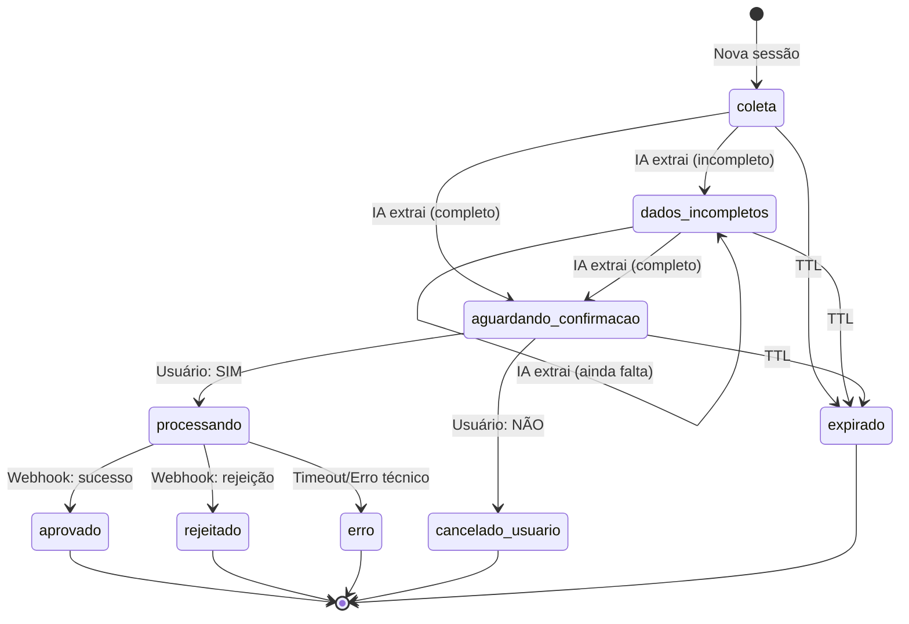

# Documentação: Mapeamento de Estados e Persistência de Dados

## Visão Geral

O sistema de emissão de NFSe utiliza uma **máquina de estados** para gerenciar o fluxo de conversa via WhatsApp. Cada estado representa uma fase específica do processo e determina quais dados são salvos no banco de dados.

---

## 📊 Estados da Sessão

### Estados Ativos (Sessão em Andamento)
1. **`coleta`** - Coletando dados iniciais
2. **`dados_incompletos`** - Faltam campos obrigatórios
3. **`aguardando_confirmacao`** - Aguardando SIM/NÃO do usuário

### Estados Terminais (Sessão Finalizada)
4. **`processando`** - Emissão NFSe em andamento
5. **`aprovado`** - NFSe emitida com sucesso
6. **`rejeitado`** - NFSe rejeitada pelo gateway
7. **`erro`** - Erro técnico durante processamento
8. **`cancelado_usuario`** - Usuário cancelou a operação
9. **`expirado`** - Sessão ultrapassou TTL (1 hora)

---

## 🔄 Diagrama da Máquina de Estados



> **Nota**: Estados terminais (`processando`, `aprovado`, `rejeitado`, `erro`, `cancelado_usuario`, `expirado`) não permitem transições adicionais.

---

## 🗄️ Estrutura de Dados Persistidos

### Modelo Principal: `SessionSnapshot`

Salva **snapshot completo** da sessão em momentos críticos.

#### Quando é Salvo?
- ✅ **Criação da sessão** (`reason='manual'`)
- ✅ **Dados completos** (`reason='data_complete'`)
- ✅ **Confirmação do usuário** (`reason='confirmed'`)
- ✅ **Cancelamento** (`reason='cancelled'`)
- ✅ **Expiração** (`reason='expired'`)
- ✅ **Erro** (`reason='error'`)

---

## 📝 Campos Salvos por Estado

### **Estado: `coleta`**

**Trigger**: Primeira mensagem do usuário

**Dados Salvos**:
```python
{
    # Identificação
    "sessao_id": "250126a3f1",  # ddmmyy + 4 hex
    "telefone": "+5511999999999",
    "estado": "coleta",
    
    # Campos NFSe (ainda vazios ou parciais)
    "cnpj_status": "null",
    "cnpj_extracted": None,
    "cnpj": None,
    "valor_status": "null",
    "valor_extracted": None,
    "valor": None,
    "descricao_status": "null",
    "descricao": None,
    
    # Completude
    "data_complete": False,
    "missing_fields": ["cnpj", "valor", "descricao"],
    "invalid_fields": [],
    
    # Métricas
    "interaction_count": 1,
    "bot_message_count": 0,
    "ai_calls_count": 0,
    
    # Timestamps
    "session_created_at": "2026-01-25T14:30:00",
    "session_updated_at": "2026-01-25T14:30:00",
    "snapshot_reason": "manual"
}
```

**Mensagens Relacionadas** (`SessionMessage`):
```python
[
    {
        "role": "user",
        "content": "oi",
        "timestamp": "2026-01-25T14:30:00",
        "order": 0
    }
]
```

---

### **Estado: `dados_incompletos`**

**Trigger**: IA extraiu dados, mas faltam campos obrigatórios

**Dados Atualizados**:
```python
{
    # Estado muda
    "estado": "dados_incompletos",
    
    # Exemplo: CNPJ extraído, mas falta valor e descrição
    "cnpj_status": "validated",
    "cnpj_extracted": "06305747000134",
    "cnpj": "06.305.747/0001-34",
    "cnpj_razao_social": "KOMPUTER INFORMATICA LTDA",
    
    "valor_status": "null",
    "valor": None,
    
    "descricao_status": "null",
    "descricao": None,
    
    # Completude
    "data_complete": False,
    "missing_fields": ["valor", "descricao"],
    "invalid_fields": [],
    "user_message": "Por favor, informe o valor do serviço e a descrição.",
    
    # Métricas incrementadas
    "interaction_count": 3,  # user + bot + user
    "bot_message_count": 1,
    "ai_calls_count": 1,  # Chamou OpenAI
    
    "session_updated_at": "2026-01-25T14:32:00"
}
```

**Mensagens Adicionadas**:
```python
[
    {"role": "user", "content": "oi", "order": 0},
    {"role": "assistant", "content": "Olá! ...", "order": 1},
    {"role": "user", "content": "cnpj 06305747000134", "order": 2},
    {"role": "assistant", "content": "Por favor, informe...", "order": 3}
]
```

---

### **Estado: `aguardando_confirmacao`**

**Trigger**: IA validou todos os campos (CNPJ, Valor, Descrição)

**Dados Atualizados**:
```python
{
    "estado": "aguardando_confirmacao",
    
    # Todos os campos validados
    "cnpj_status": "validated",
    "cnpj": "06.305.747/0001-34",
    "cnpj_razao_social": "KOMPUTER INFORMATICA LTDA",
    
    "valor_status": "validated",
    "valor_extracted": "500",
    "valor": 500.00,
    "valor_formatted": "R$ 500,00",
    
    "descricao_status": "validated",
    "descricao_extracted": "Serviços de consultoria em TI",
    "descricao": "Serviços de consultoria em TI",
    
    # Completude atingida
    "data_complete": True,
    "missing_fields": [],
    "invalid_fields": [],
    "user_message": "Todos os dados estão corretos!",
    
    # Métricas
    "interaction_count": 5,
    "bot_message_count": 2,
    "ai_calls_count": 2,
    
    "session_updated_at": "2026-01-25T14:35:00",
    "snapshot_reason": "data_complete"  # ← Motivo especial
}
```

**Mensagem do Bot**:
```
📋 *ESPELHO DA NOTA FISCAL*

🏢 *Tomador*
KOMPUTER INFORMATICA LTDA
CNPJ: 06.305.747/0001-34

💰 *Valor*
R$ 500,00

📝 *Descrição do Serviço*
Serviços de consultoria em TI

---
✅ Digite *SIM* para confirmar
❌ Digite *NÃO* para cancelar
```

---

### **Estado: `processando`**

**Trigger**: Usuário digitou "SIM"

**Dados Atualizados**:
```python
{
    "estado": "processando",
    
    # ID de integração gerado para rastreamento
    "id_integracao": "250126a3f1-nfse",
    
    "session_updated_at": "2026-01-25T14:36:00",
    "snapshot_reason": "confirmed"
}
```

**Ação Executada**:
```python
# apps/nfse/services/emissao.py
nfse = NFSeEmissaoService.emitir_de_sessao(session.sessao_id)
```

**Registros Criados**:

1. **`NFSeEmissao`** (tabela `nfse_nfseemissao`)
```python
{
    "session_id": 5,  # FK para SessionSnapshot
    "prestador_id": 2,  # FK para Empresa
    "tomador_id": 1,  # FK para ClienteTomador
    "id_integracao": "250126a3f1-nfse",
    "status": "enviado",
    "codigo_servico": "14.10",
    "descricao_servico": "Serviços de consultoria em TI",
    "valor_servico": 500.00,
    "aliquota": 3.00,
    "payload_enviado": {...},  # JSON completo enviado
    "created_at": "2026-01-25T14:36:00",
    "enviado_em": "2026-01-25T14:36:01"
}
```

2. **`ClienteTomador`** (criado se não existir)
```python
{
    "cnpj": "06305747000134",
    "razao_social": "KOMPUTER INFORMATICA LTDA",
    "email": "contato@komputer.com.br",
    "logradouro": "RUA EXEMPLO",
    "numero": "123",
    "cidade": "São Paulo",
    "estado": "SP",
    "created_at": "2026-01-25T14:35:59"
}
```

---

### **Estado: `aprovado`**

**Trigger**: Webhook do gateway (NFSe autorizada)

**Dados Atualizados**:
```python
{
    "estado": "aprovado",
    "session_updated_at": "2026-01-25T14:36:05"
}
```

**Registro Criado**: **`NFSeProcessada`**
```python
{
    "emissao_id": 1,  # FK para NFSeEmissao
    "id_externo": "64dd4bac-f43b-41ad-afed-5d275a3c4b61",
    "numero": "332582",
    "serie": "001",
    "chave": "412601063057470001343455805000332582C",
    "protocolo": "682178131266847",
    "status": "CONCLUIDO",
    "c_stat": 100,
    "emitente": "06305747000134",
    "destinatario": "12345678000199",
    "valor": 500.00,
    "data_emissao": "2026-01-25",
    "data_autorizacao": "2026-01-25",
    "url_xml": "https://cdn.tecnospeed.com.br/...",
    "url_pdf": "https://cdn.tecnospeed.com.br/...",
    "webhook_payload": {...},  # JSON completo do webhook
    "created_at": "2026-01-25T14:36:05"
}
```

---

### **Estado: `cancelado_usuario`**

**Trigger**: Usuário digitou "NÃO"

**Dados Atualizados**:
```python
{
    "estado": "cancelado_usuario",
    "session_updated_at": "2026-01-25T14:37:00",
    "snapshot_reason": "cancelled"
}
```

**Mensagem Adicionada**:
```python
{
    "role": "system",
    "content": "2026-01-25 14:37:00 Solicitação cancelada pelo usuário.",
    "order": 7
}
```

---

### **Estado: `expirado`**

**Trigger**: TTL ultrapassado (1 hora de inatividade)

**Dados Atualizados**:
```python
{
    "estado": "expirado",
    "snapshot_reason": "expired"
}
```

**Lógica de Verificação**:
```python
# apps/core/db_models.py - método is_expired()
now = timezone.now()
expiration = self.session_updated_at + timedelta(seconds=self.ttl)
return now > expiration
```

---

## 🔄 Fluxo de Transições de Estado

```
coleta
  ↓ (IA extrai dados)
dados_incompletos ──┐
  ↓                 │ (loop até completar)
  └─────────────────┘
  ↓ (todos campos OK)
dados_completos
  ↓ (save_session reason='data_complete')
aguardando_confirmacao
  ↓
  ├─→ [usuário: "SIM"] → processando → aprovado/rejeitado/erro
  └─→ [usuário: "NÃO"] → cancelado_usuario
```

---

## 🔍 Rastreabilidade de Dados

### Como Encontrar Uma Sessão no Banco?

```sql
-- Por telefone
SELECT * FROM core_sessionsnapshot 
WHERE telefone = '+5511999999999' 
ORDER BY session_created_at DESC 
LIMIT 1;

-- Por CNPJ
SELECT * FROM core_sessionsnapshot 
WHERE cnpj = '06.305.747/0001-34';

-- Por ID integração
SELECT * FROM core_sessionsnapshot 
WHERE id_integracao = '250126a3f1-nfse';

-- Sessões com dados completos
SELECT * FROM core_sessionsnapshot 
WHERE data_complete = TRUE 
AND estado = 'aguardando_confirmacao';
```

### Como Encontrar NFSe Relacionada?

```sql
-- Via ID integração
SELECT 
    ss.sessao_id,
    ss.telefone,
    ne.id_integracao,
    ne.status,
    np.numero AS nfse_numero
FROM core_sessionsnapshot ss
LEFT JOIN nfse_nfseemissao ne ON ne.session_id = ss.id
LEFT JOIN nfse_nfseprocessada np ON np.emissao_id = ne.id
WHERE ss.sessao_id = '250126a3f1';
```

---

## 📈 Métricas Salvas

Cada snapshot registra:

| Campo | Descrição | Incrementado Quando |
|-------|-----------|---------------------|
| `interaction_count` | Total de mensagens (user + bot + system) | A cada mensagem enviada/recebida |
| `bot_message_count` | Apenas mensagens do bot | `session.add_bot_message()` |
| `ai_calls_count` | Chamadas à OpenAI API | `session.increment_ai_calls()` |

**Exemplo de evolução**:
```
Interação 1: user: "oi" → interaction_count=1, ai_calls=0
Interação 2: bot: "Olá!" → interaction_count=2, bot_count=1
Interação 3: user: "cnpj 123" → interaction_count=3, ai_calls=1 (OpenAI chamada)
Interação 4: bot: "Informe valor" → interaction_count=4, bot_count=2
```

---

## 🎯 Conclusão

**Dados Salvos**:
- ✅ **SessionSnapshot**: Estado completo da máquina de estados
- ✅ **SessionMessage**: Histórico completo de mensagens
- ✅ **NFSeEmissao**: Dados de emissão enviados ao gateway
- ✅ **NFSeProcessada**: NFSe autorizada com XML/PDF
- ✅ **ClienteTomador**: Cadastro do cliente consultado na Receita

**Gatilhos de Persistência**:
1. Primeira mensagem (criação)
2. Dados completos (validação)
3. Confirmação/cancelamento (decisão)
4. Expiração (TTL)
5. Processamento NFSe (integração)

**Rastreabilidade Total**:
- Todas as transições de estado são logadas
- Todas as mensagens são preservadas
- Todos os snapshots têm timestamp e motivo (`snapshot_reason`)
