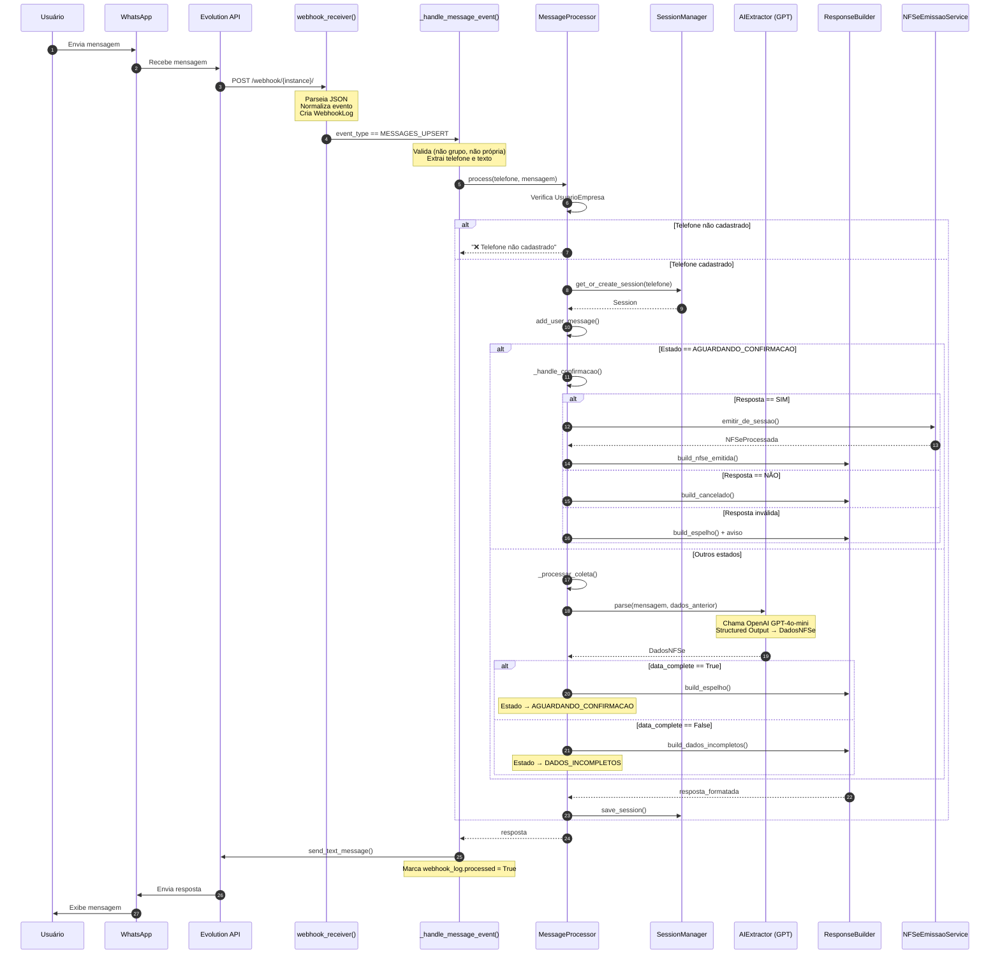
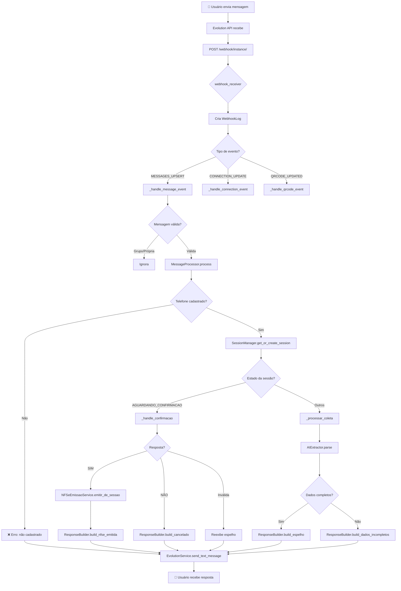

# Fluxo de Mensagem WhatsApp - Do Webhook à Resposta

Este documento descreve o fluxo completo quando um usuário envia uma mensagem para o WhatsApp da contabilidade, desde o recebimento do webhook até a resposta final.

---

## 📋 Visão Geral

```
Usuário → WhatsApp → Evolution API → Webhook → MessageProcessor → IA → Resposta → Evolution API → WhatsApp → Usuário
```

---

## 🔄 Fluxo Detalhado

### 1️⃣ Recebimento do Webhook

**Rota:** `POST /whatsapp/webhook/<instance_name>/`

**Arquivo:** `apps/whatsapp_api/urls.py`
```python
path('webhook/<str:instance_name>/', views.webhook_receiver, name='webhook_receiver'),
```

**Função:** `webhook_receiver()` em `apps/whatsapp_api/views.py`

| Etapa | Descrição |
|-------|-----------|
| 1.1 | Recebe POST da Evolution API |
| 1.2 | Parseia JSON do payload |
| 1.3 | Normaliza tipo do evento (`messages.upsert` → `MESSAGES_UPSERT`) |
| 1.4 | Busca canal pelo `instance_name` |
| 1.5 | Cria `WebhookLog` (processed=False) |
| 1.6 | Roteia para handler específico do evento |

---

### 2️⃣ Handler de Mensagem

**Função:** `_handle_message_event()` em `apps/whatsapp_api/views.py`

| Etapa | Descrição |
|-------|-----------|
| 2.1 | Verifica se é mensagem de grupo (`@g.us`) → ignora |
| 2.2 | Verifica se é mensagem própria (`fromMe`) → ignora |
| 2.3 | Extrai telefone do `remoteJid` ou `sender` |
| 2.4 | Extrai texto da mensagem (`conversation` ou `extendedTextMessage`) |
| 2.5 | Atualiza `WebhookLog` com `phone_from` e `message_text` |
| 2.6 | Chama `MessageProcessor.process(phone, message)` |
| 2.7 | Recebe resposta e envia via `EvolutionService.send_text_message()` |
| 2.8 | Marca `webhook_log.processed = True` |

---

### 3️⃣ Processamento da Mensagem

**Classe:** `MessageProcessor` em `apps/core/message_processor.py`

**Método:** `process(telefone, mensagem)`

| Etapa | Descrição |
|-------|-----------|
| 3.1 | Verifica se telefone está cadastrado (`UsuarioEmpresa`) |
| 3.2 | Se não cadastrado → retorna mensagem de erro |
| 3.3 | Recupera ou cria sessão via `SessionManager` |
| 3.4 | Adiciona mensagem do usuário ao histórico |
| 3.5 | Verifica estado da sessão e roteia: |
|     | → `AGUARDANDO_CONFIRMACAO` → `_handle_confirmacao()` |
|     | → Outros estados → `_processar_coleta()` |
| 3.6 | Adiciona resposta do bot ao histórico |
| 3.7 | Salva sessão atualizada |
| 3.8 | Retorna resposta |

---

### 4️⃣ Coleta de Dados (Fluxo Principal)

**Método:** `_processar_coleta()` em `apps/core/message_processor.py`

| Etapa | Descrição |
|-------|-----------|
| 4.1 | Chama `AIExtractor.parse(mensagem, dados_anterior)` |
| 4.2 | Mescla dados extraídos com dados anteriores |
| 4.3 | Atualiza `invoice_data` na sessão |
| 4.4 | Verifica se dados estão completos (`data_complete`) |
| 4.5a | **Se completo:** muda estado para `AGUARDANDO_CONFIRMACAO` |
|      | → `ResponseBuilder.build_espelho()` |
| 4.5b | **Se incompleto:** muda estado para `DADOS_INCOMPLETOS` |
|      | → `ResponseBuilder.build_dados_incompletos()` |

---

### 5️⃣ Extração com IA

**Classe:** `AIExtractor` em `apps/core/agent_extractor.py`

**Método:** `parse(user_message, dados_anterior)`

| Etapa | Descrição |
|-------|-----------|
| 5.1 | Carrega prompt do arquivo `prompts/prompt_conversacional.txt` |
| 5.2 | Monta contexto com dados anteriores (se houver) |
| 5.3 | Chama OpenAI GPT-4o-mini com `response_format=DadosNFSe` |
| 5.4 | Retorna objeto `DadosNFSe` estruturado |

---

### 6️⃣ Confirmação (Fluxo de Confirmação)

**Método:** `_handle_confirmacao()` em `apps/core/message_processor.py`

| Resposta | Ação |
|----------|------|
| `SIM/S/OK` | Muda estado para `PROCESSANDO` → Chama `NFSeEmissaoService.emitir_de_sessao()` |
| `NÃO/N/CANCELAR` | Muda estado para `CANCELADO_USUARIO` → `ResponseBuilder.build_cancelado()` |
| Outra resposta | Reexibe espelho + solicita SIM ou NÃO |

---

### 7️⃣ Emissão de NFSe (Após Confirmação)

**Classe:** `NFSeEmissaoService` em `apps/nfse/services/emissao.py`

**Método:** `emitir_de_sessao(sessao_id)`

| Etapa | Descrição |
|-------|-----------|
| 7.1 | Busca sessão no banco (`SessionSnapshot`) |
| 7.2 | Busca prestador pelo telefone (`UsuarioEmpresa` → `Empresa`) |
| 7.3 | Consulta/cria tomador na Receita Federal |
| 7.4 | Monta JSON da NFSe via `NFSeBuilder` |
| 7.5 | Envia para gateway (mock) |
| 7.6 | Cria `NFSeProcessada` |
| 7.7 | Retorna NFSe emitida |

---

### 8️⃣ Envio da Resposta

**Classe:** `EvolutionService` em `apps/whatsapp_api/services/evolution.py`

**Método:** `send_text_message(instance_name, phone_number, message)`

| Etapa | Descrição |
|-------|-----------|
| 8.1 | Normaliza número (remove caracteres especiais) |
| 8.2 | Adiciona sufixo `@s.whatsapp.net` |
| 8.3 | Faz POST para Evolution API `/message/sendText/{instance}` |
| 8.4 | Evolution API entrega via WhatsApp |

---

### 9️⃣ Construção de Respostas

**Classe:** `ResponseBuilder` em `apps/core/reponse_builder.py`

| Método | Quando usar |
|--------|-------------|
| `build_dados_incompletos()` | Dados faltando (usa `user_message` da IA) |
| `build_espelho()` | Dados completos → exibe resumo para confirmação |
| `build_cancelado()` | Usuário cancelou |
| `build_nfse_emitida()` | NFSe emitida com sucesso |
| `build_nota_erro()` | Erro na emissão |

---

## 🗂️ Gerenciamento de Sessão

**Classe:** `SessionManager` em `apps/core/session_manager.py`

| Método | Descrição |
|--------|-----------|
| `get_or_create_session()` | Recupera sessão ativa ou cria nova |
| `get_session()` | Busca sessão ativa (não terminal, não expirada) |
| `create_session()` | Cria nova sessão |
| `save_session()` | Salva snapshot no SQLite |

**Estados da Sessão** (`SessionState` em `apps/core/states.py`):
- `NOVA` → `DADOS_INCOMPLETOS` → `AGUARDANDO_CONFIRMACAO` → `PROCESSANDO` → `CONCLUIDO`
- Estados terminais: `CONCLUIDO`, `CANCELADO_USUARIO`, `EXPIRADO`, `ERRO`

---

## 📁 Arquivos Envolvidos

| Arquivo | Responsabilidade |
|---------|------------------|
| `apps/whatsapp_api/urls.py` | Rota do webhook |
| `apps/whatsapp_api/views.py` | `webhook_receiver`, `_handle_message_event` |
| `apps/whatsapp_api/services/evolution.py` | `EvolutionService` - comunicação com API |
| `apps/whatsapp_api/models.py` | `CanalWhatsApp`, `WebhookLog` |
| `apps/core/message_processor.py` | `MessageProcessor` - orquestrador |
| `apps/core/session_manager.py` | `SessionManager` - gestão de sessões |
| `apps/core/agent_extractor.py` | `AIExtractor` - extração com GPT |
| `apps/core/reponse_builder.py` | `ResponseBuilder` - monta respostas |
| `apps/core/states.py` | `SessionState` - máquina de estados |
| `apps/nfse/services/emissao.py` | `NFSeEmissaoService` - emite nota |

---

## 📊 Diagrama Mermaid



---

## 🔄 Fluxo Simplificado (Flowchart)



---

## ⏱️ Tempos Estimados

| Etapa | Tempo |
|-------|-------|
| Webhook → Handler | ~10ms |
| Verificação telefone | ~5ms |
| Recuperar sessão | ~10ms |
| Extração IA (OpenAI) | ~500-2000ms |
| Construir resposta | ~5ms |
| Enviar via Evolution | ~100-300ms |
| **Total** | **~600-2500ms** |

---

## 🚨 Tratamento de Erros

| Local | Erro | Ação |
|-------|------|------|
| `webhook_receiver` | JSON inválido | Retorna 400 |
| `_handle_message_event` | Erro ao processar | Salva em `webhook_log.error_message` |
| `MessageProcessor` | Telefone não cadastrado | Retorna mensagem amigável |
| `AIExtractor` | Falha OpenAI | Retorna mensagem genérica |
| `NFSeEmissaoService` | Erro emissão | Notifica erro ao usuário |
| `EvolutionService` | Falha envio | Log + `webhook_log.error_message` |

---

*Documento gerado em: Fevereiro/2026*
